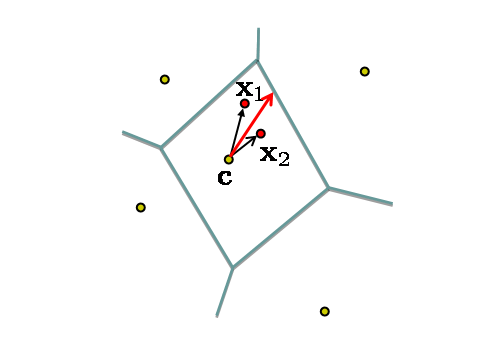

# Recognition of object categories practical

This is an [Oxford Visual Geometry Group](http://www.robots.ox.ac.uk/~vgg) computer vision practical, authored by [Andrea Vedaldi](http://www.robots.ox.ac.uk/~vedaldi/) and Andrew Zisserman (Release 2015a).

This practical is on image classification, where an image is classified according to its visual content. For example, does it contain an airplane or not. Important applications are image retrieval - searching through an image dataset to obtain (or retrieve) those images with particular visual content, and image annotatvion - adding tags to images if they contain particular object categories.

The goal of this session is to get basic practical experience with image classification. It includes: (i) training a visual classifier for five different image classes (airplanes, motorbikes, people, horses and cars); (ii) assessing the performance of the classifier by computing a precision-recall curve; (iii) varying the visual representation used for the feature vector, and the feature map used for the classifier; and (iv) obtaining training data for new classifiers using Bing image search and using the classifiers to retrieve images from a dataset.

[TOC]

## Getting started

Read and understand the [requirements and installation instructions](../overview/index.html#installation). The download links for this practical are:

* Code and data: [practical-category-recognition-2015a.tar.gz](http://www.robots.ox.ac.uk/~vgg/share/practical-category-recognition-2015a.tar.gz) 914MB
* Code only: [practical-category-recognition-2015a-code-only.tar.gz](http://www.robots.ox.ac.uk/~vgg/share/practical-category-recognition-2015a-code-only.tar.gz) 12MB
* Data only: [practical-category-recognition-2015a-data-only.tar.gz](http://www.robots.ox.ac.uk/~vgg/share/practical-category-recognition-2015a-data-only.tar.gz) 902MB
* [Git repository](https://github.com/vedaldi/practical-object-category-recognition) (for lab setters and developers)

After the installation is complete, open and edit the script exercise1.m in the MATLAB editor. The script contains commented code and a description for all steps of this exercise, relative to [Part I](#part1) of this document. You can cut and paste this code into the MATLAB window to run it, and will need to modify it as you go through the session. Other files such as `exercise2.m`, contain the code for other parts of the practical, as indicated below.

Note: the student packages contain only the code required to run the practical. The complete package, including code to preprocess the data, is available on GitHub.

## Part 1: Training and testing an Image Classifier {#part1}

### Stage 1.A: Data Preparation

The data provided in the directory data consists of images and pre-computed descriptors for each image. The JPEG images are contained in data/images. The data consists of three image classes (containing airplanes, motorbikes or persons) and`background' images (i.e. images that do not contain these three classes). In the data preparation stage, this data is divided as:

| --     | aeroplane | motorbike | person | background |
|--------|-----------|-----------|--------|------------|
| train  | 112       | 120       | 1025   | 1019       |
| test   | 126       | 125       | 983    | 1077       |
| total	 | 238       | 245       | 2008   | 2096       |

A descriptor for an image is obtained as a statistics of local image features, which in turn capture the appearance of a large number of local image regions. Mapping local features to a single descriptor vector is often regarded as an encoding step, and the resulting descriptor is sometimes called a code. Compared to sets of local features, a main benefit of working with codes is that codes can be compared by simple vectorial metrics such as the Euclidean distance. For the same reason, they are also much easier to use in learning an image classifier.

In this part we will use the Bag of Visual Words (BoVW) encoding. The process of constructing a BoVW descriptor starting from an image is summarized next: 

First, SIFT features are computed on a regular grid across the image (''dense SIFT'') and vector quantized into visual words. The frequency of each visual word is then recorded in a histogram for each tile of a spatial tiling as shown. The final feature vector for the image is a concatenation of these histograms.

> **Question:** The spatial tiling is an optional step. Why do you think this is useful?

### Stage 1.B: Train a classifier for images containing motorbikes

We will start by training a classifier for images that contain motorbikes. The files `data/motorbike_train.txt` and `data/motorbike_val.txt` list images that contain motorbikes. 

> **Task:** Look through example images of the motorbike class and the background images by browsing the image files in the data directory.

The motorbike training images will be used as the positives, and the background 
images as negatives. The classifier is a linear Support Vector Machine (SVM). 

> **Task:** Train the classifier by following the steps in `exercise1.m`.

We will first assess qualitatively how well the classifier works by using it to rank all the training images. 

> **Question:** What do you expect to happen? 
> **Task:** View the ranked list using the provided function `displayRankedImageList` as shown in `excercise1.m`.

You can use the function `displayRelevantVisualWords` to display the image patches that correspond to the visual words which the classifier thinks are most related to the class (see the example embedded in `exercise1.m`).

> **Queston:** Do the words correspond to patches you would expect to be selected?

### Stage 1.C: Classify the test images and assess the performance

Now apply the learnt classifier to the test images. Again, you can look at the qualitative performance by using the classifier score to rank all the test images. Note the bias term is not needed for this ranking, only the classification vector w.

> **Question:** Why is the bias term not needed?

Now we will measure the retrieval performance quantitatively by computing a Precision-Recall curve. Recall the definitions of Precision and Recall:

The Precision-Recall curve is computed by varying the threshold on the classifier (from high to low) and plotting the values of precision against recall for each threshold value. In order to assess the retrieval performance by a single number (rather than a curve), the Average Precision (AP, the area under the curve) is often computed.
 Make sure you understand how the precision values in the Precision-Recall curve correspond to the ranking of the positives and negatives in the retrieved results
 
### Stage 1.D: Learn a classifier for the other classes and assess its performance

*Skip to [Stage 1.E](#stage1e) on fast track*

Now repeat Stage B and C for each of the other two classes: airplanes and people. To do this you can simply rerun exercise1.m after changing the dataset loaded at the beginning in stage (A). Remember to change both the training and test data. In each case record the AP performance measure.

> **Question:** Does the AP performance match your expectations based on the variation of the class images?

### Stage 1.E: Vary the image representation

An important practical aspect of image descriptors is the one of their normalization. For example, BoVW descriptors are histograms, and regarding them as discrete probability distributions it would seem natural that their elements should sum to 1. This is the same as normalizing the BoVW descriptor vectors in L1 norm. However, in `exercise1.m` L2 normalization (sum of squares) is used instead.

> **Task:** Modify `exercise1.m` to use L1 normalization and no normalization and measure the performance change.

A linear SVM can be thought of as using a linear kernel
$$
 K(\mathbf{h},\mathbf{h}') = \sum_{i=1}^d h_i h'_i
$$
to measure the similarity between pair of objects $h$ and $h'$ (in this case pairs of BoVW descriptors).

> **Question:** What can you say about the self-similarity,$K(\mathbf{h},\mathbf{h})$, of a BoVW histogram $\mathbf{h}$ that is L2 normalized?

Compare $K(\mathbf{h},\mathbf{h})$ to the similarity, $K(\mathbf{h},\mathbf{h}')$,of two different L2 normalized BoVW histograms $\mathbf{h}$ and $\mathbf{h}'$

> **Questions:**

> * Can you say the same for unnormalized or L1 normalized histograms?
> * Do you see a relation between the classification performance and L2 normalization?

A useful rule of thumb is that better performance is obtained if the vectors that are ultimately fed to a linear SVM (after any intermediate processing) are L2 normalized.

**Skip to Stage F on fast track**

Up to this point, the image feature vector has used spatial tiling. Now, we are going to ''turn this off'' and see how the performance changes. In this part, the image will simply be represented by a single histogram recording the frequency of visual words (but not taking any account of their image position).

A spatial histogram can be converted back to a simple histogram by merging the tiles. 

> **Task:** Edit `exercise1.m` to turn on the part of the code that does so. Then evaluate the classifier performance on the test images.
> **Question:** Why is there a change in performance?

### Stage 1.F: Vary the classifier

Up to this point we have used a linear SVM, treating the histograms representing each image as vectors normalized to a unit Euclidean norm. Now we will use a Hellinger kernel classifier but instead of computing kernel values we will explicitly compute the feature map, so that the classifier remains linear (in the new feature space). The definition of the Hellinger kernel (also known as the Bhattacharyya coefficient) is
$$
 K(\mathbf{h},\mathbf{h}') = \sum_{i=1}^d \sqrt{h_i h'_i}
$$
where $\mathbf{h}$ and $\mathbf{h}'$ are normalized histograms. Compare this with the expression of the linear kernel given above: all that is involved in computing the feature map is taking the square root of the histogram values.

> **Questions:**

> * Based on the rule of thumb introduced above, how should the BoVW histograms $\mathbf{h}$ and $\mathbf{h}'$ be normalized?
> * Should you apply this normalization before or after taking the square root?

Now we will again learn the image classifier using the Hellinger kernel instead of the linear one.

> **Tasks:**

> * Edit `exercise1.m` so that the square root of the histograms are used for the feature vectors. Make sure that the proper normalization is used. In practice this involves writing one line of MATLAB code for the training and one for the test histograms.
> * Retrain the classifier for the motorbike class, and measure its performance on the test data.
> * Try the other histogram normalization options and check that your choice yields optimal performance.

> **Questions:**

> * Why is this procedure equivalent to using the Hellinger kernel in the SVM classifier?
> * Why is it an advantage to keep the classifier linear, rather than using a non-linear kernel?

**Note:** when learning the SVM, to save training time we are not changing the $C$ parameter. This parameter influences the generalization error and should be learnt on a validation set when the kernel is changed. However, in this case the influence of $C$ is small as can be verified experimentally.

### Stage 1.G: Vary the number of training images

**Skip to Part 2 on fast track**

Up to this point we have used all the available training images. Now edit exercise1.m and change the fraction variable to use 10% and 50% of the training data.

> **Question:** What performance do you get with the linear kernel? And with the Hellinger kernel?
> **Question:** Do you think the performance has `saturated' if all the training images are used, or would adding more training images give an improvement?

## Part 2: Training an Image Classifier for Retrieval using Bing images

In Part 1 of this practical the training data was provided and all the feature vectors pre-computed. The goal of this second part is to choose the training data yourself in order to optimize the classifier performance. The task is the following: you are given a large corpus of images and asked to retrieve images of a certain class, e.g. those containing a bicycle. You then need to obtain training images, e.g. using Bing Image Search, in order to train a classifier for images containing bicycles and optimize its retrieval performance.

The MATLAB code exercise2.m provides the following functionality: it uses the images in the directory data/myImages and the default negative list data/background_train.txt to train a classifier and rank the test images. To get started, we will train a classifier for horses:

Use Bing image search with ''horses'' as the text query (you can also set the photo option on)

Pick 5 images and drag and drop (save) them into the directory `data/myImages`. These will provide the positive training examples.

> **Tasks:**

> * Run the code exercise2.m and view the ranked list of images. Note, since feature vectors must be computed for all the training images, this may take a few moments.
> * Now, add in 5 more images and retrain the classifier.

The test data set contains 148 images with horses. Your goal is to train a classifier that can retrieve as many of these as possible in a high ranked position. You can measure your success by how many appear in the first 36 images (this performance measure is `precision at rank-36'). Here are some ways to improve the classifier:

> **Tasks:**

> * Add more positive training images.
> * Add more positive training images, but choose these to be varied from those you already have.

**Note:** all images are automatically normalized to a standard size, and descriptors are saved for each new image added in the data/cache directory. The test data also contains the category car. Train classifiers for it and compare the difficulty of this and the horse class.

## Part 3: Advanced Encoding Methods

**Skip to end on fast track**

Up to this point we have used a BoVW representation of the original dense SIFT description of the image, together with spatial information coded by a spatial tiling of the image. The BoVW representation is simply a histogram of the number of SIFT vectors assigned to each visual word. The histogram has K bins, where K is the size of the vocabulary created by K-means, and each bin corresponds to a count of the SIFT vectors lying in the Voronoi cell associated with that visual word.

The BoVW is an encoding of the dense SIFTs into a feature vector. One way to think about the encoding is that it aims to best represent the distribution of SIFT vectors of that image (in a manner that is useful for discriminative classification). BoVW is a hard-assignment of SIFTs to visual words, and alternative soft-assignment methods are possible where the count for a SIFT vector is distributed across several histogram bins. 

In this section we investigate a different encoding that records more than a simple count as a representation of the distribution of SIFT vectors. In particular we consider two encodings: one that records first moment information (such as the mean) of the distribution assigned to each Voronoi cell, and a second that records both the first and second moment (e.g. the mean and covariance of the distribution). The MATLAB code for computing these encodings in the file exercise1.m.

### Stage H: First order methods

The vector of locally aggregated descriptors (VLAD) is an example of a first order encoding. It records the residuals of vectors within each Voronoi cell (i.e. the  difference between the SIFT vectors and the cluster centre (from the k-means) as illustrated below:

Suppose the SIFT descriptors have dimension $D$, then the total size of the VLAD vector is $K \times D$ (since a D-dimensional residual is recorded for each Voronoi cell). Typically, $K$ is  between 16 and 512, and D is 128 or less.

> **Question:** Compare the dimension of VLAD and BoVW vectors for a given value of K. What should be the relation of the K in VLAD to the K in BoVW in order to obtain descriptors of the same dimension?
> **Task:** Replace the encoding used in exercise1 with the VLAD encoding, and repeat the classification experiments for the three classes of Part I.

Note, the performance improvement obtained simply by changing the feature encoding.

### Stage I: Second order methods

The Fisher Vector (FV) is an example of second order encoding. It records both the residuals (as in VLAD) and also the covariance of the SIFTs assigned to each Voronoi cell. Its implementation uses a Gaussian Mixture Model (GMM) (instead of k-means) and consequently SIFTs are softly assigned to mixture components (rather than a hard assignment as in BoVW). Suppose there are k mixture components and the covariance is restricted to a diagonal matrix (i.e. only the variance of each component is recorded) then the total size of the Fisher vector is $2K \times d$.

Look through the computation of the FV

> **Task:** Replace the encoding used in exercise1 with the FV encoding, and repeat the classification experiments for the three classes of Part I.

Note, the performance improvement obtained (over BoVW and VLAD) 

> **Question:** What are the advantages or disadvantages of FV compared to VLAD in terms of computation time and storage/memory footprint - especially for a large number (hundreds of millions) of images.

That completes this practical.

## Links and further work

* The code for this practical is written using the software package [VLFeat](http://www.vlfeat.org). This is a software library written in MATLAB and C, and is freely available as source code and binary.
* The images for this practical are taken from the [PASCAL VOC 2007 benchmark](http://pascallin.ecs.soton.ac.uk/challenges/VOC/voc2007/).
* For a tutorial on large scale image classification and references to the literature, see [here](https://sites.google.com/site/lsvr13/).
* If there is a significant difference between the training and test performance, then that indicates over fitting. The difference can often be reduced, and the test performance (generalization) improved by changing the SVM C parameter. In [Part I](#part1), vary the $C$ parameter in the range 0.1 to 1000 (the default is $C=100$), and plot the AP on the training and test data as C varies for the linear and Hellinger kernels.

## Acknowledgements

* Guidance from Ivan Laptev and Josef Sivic.
* Comments from Relja Arandjelovic, Yusuf Aytar and Varun Gulshan, Sobhan NaderiParizi, Elliot Crowley
* Bug correction due to Oleg Tishutin.
* Funding from ERC grant VisRec Grant No. 228180, and a PASCAL Harvest Grant.

## History

* Used in the Oxford AIMS CDT, 2014-15
* Used at ENS/INRIA Visual Recognition and Machine Learning Summer School, 2012.
* Used at JHU Summer School on Human Language Technology, 2012.
* Used at ENS/INRIA Visual Recognition and Machine Learning Summer School, 2011.
* Used at Microsoft Computer Vision School, Moscow, 2011.
